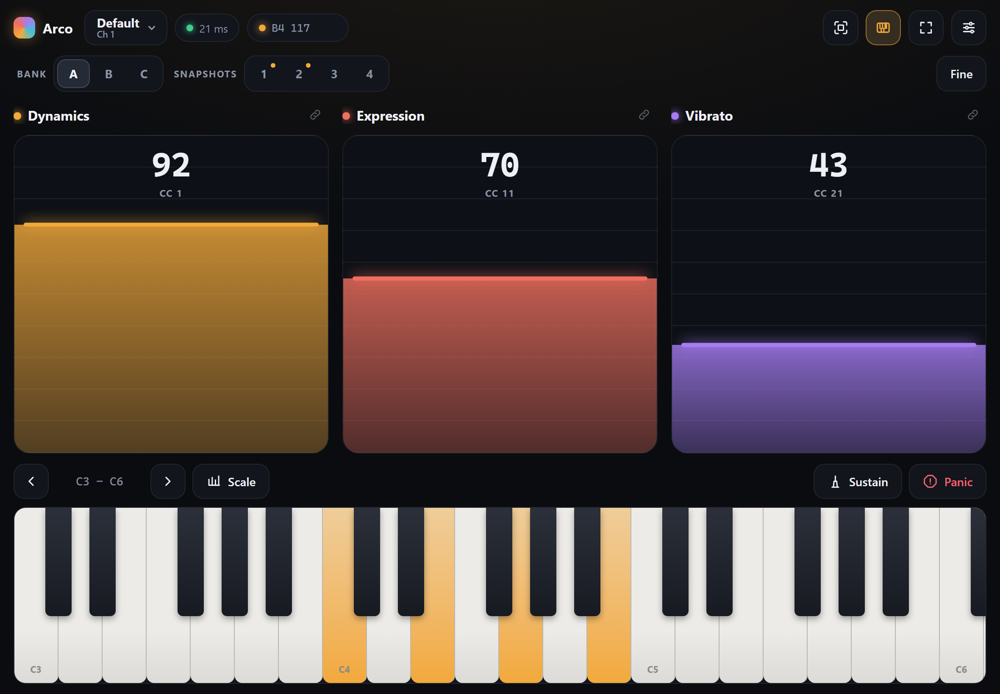
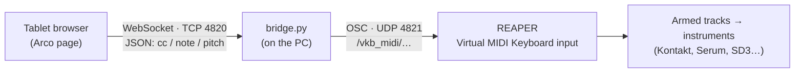
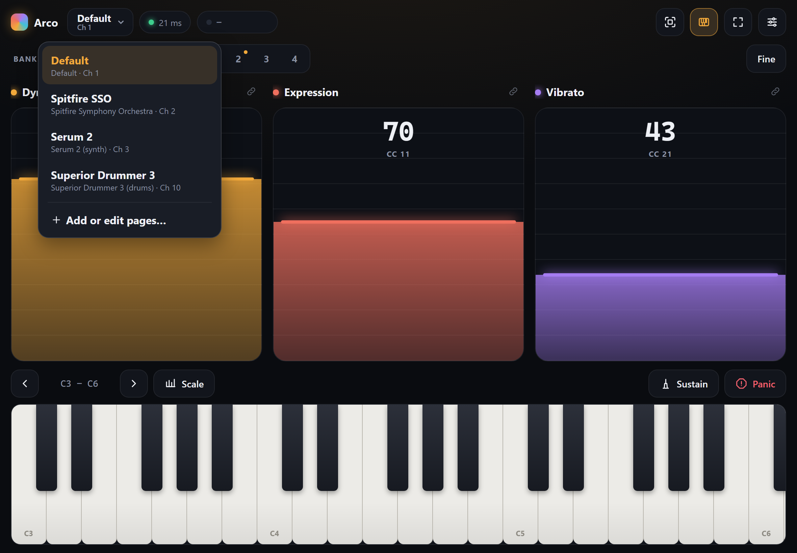
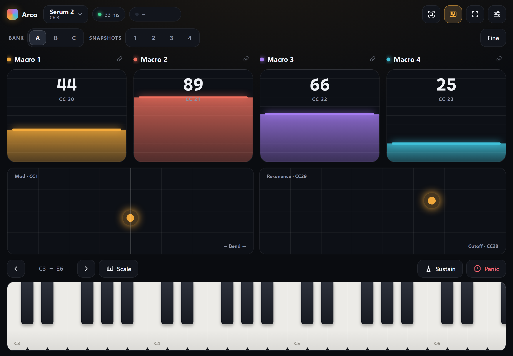
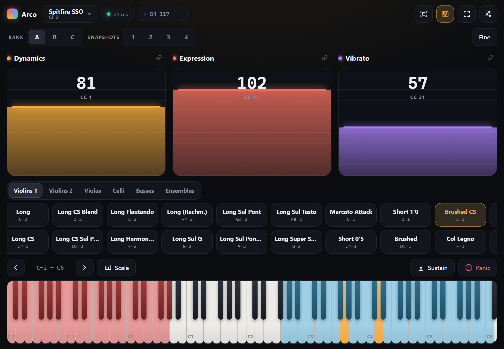
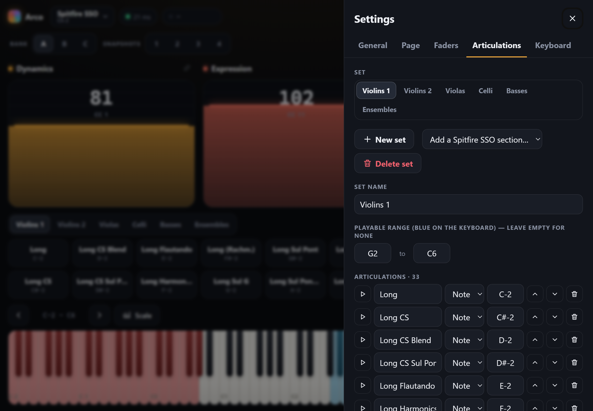
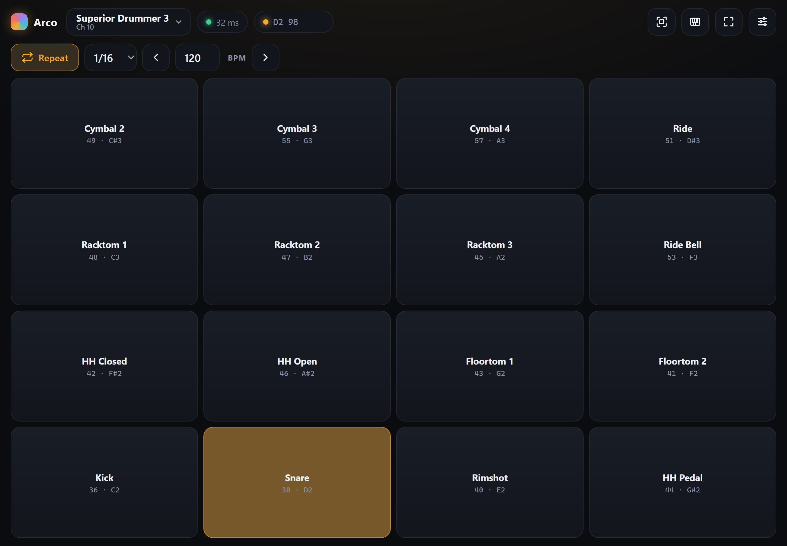
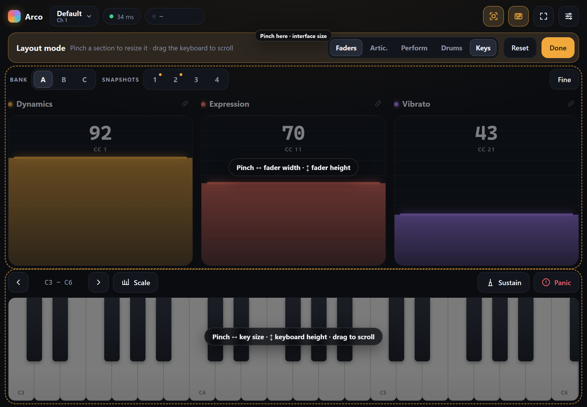
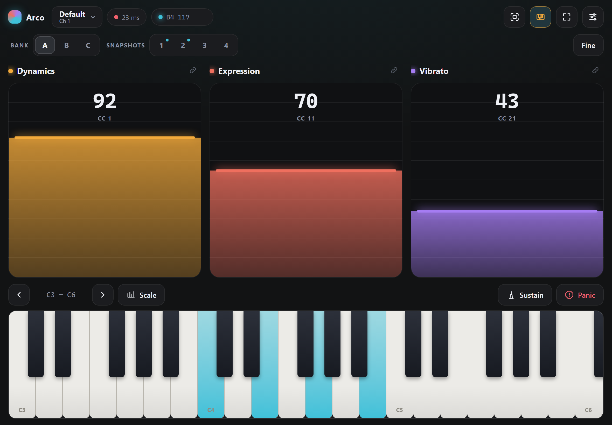

# Arco

**Expressive MIDI control for REAPER, from your tablet.**

Arco turns an iPad (or any tablet or phone with a browser) into a Wi‑Fi MIDI controller for REAPER:
faders for dynamics, expression and vibrato, articulation keyswitches, a playable keyboard, pitch bend /
mod / XY pads for synths, and drum pads — organised into **pages**, one per instrument.
It was built for writing orchestral strings (riding CC1/CC11 while playing), and grew into a general
controller for Spitfire, Serum, Superior Drummer and anything else that listens to MIDI.

*Arco* is the Italian marking for "play with the bow" — which is what riding a dynamics fader feels like.



- **No app to install** on the tablet — it's a web page served by a tiny bridge on your PC.
- **No MIDI drivers** on the PC — the bridge talks to REAPER over OSC, which REAPER supports out of the box.
- **Python standard library only** — one script, no `pip install`.

---

## Contents

- [How it works](#how-it-works)
- [Quick start](#quick-start)
- [Pages (instruments)](#pages-instruments)
- [Faders](#faders)
- [Articulations](#articulations)
- [Keyboard](#keyboard)
- [Perform: pitch bend, mod & XY](#perform-pitch-bend-mod--xy)
- [Drum pads](#drum-pads)
- [Layout mode: pinch to resize](#layout-mode-pinch-to-resize)
- [Settings](#settings)
- [Plugin guides](#plugin-guides)
- [Reference](#reference)
- [Troubleshooting](#troubleshooting)
- [Project structure](#project-structure)
- [Roadmap](#roadmap)

---

## How it works



1. `bridge.py` serves the Arco page to your tablet and keeps a WebSocket open to it.
2. Every fader move, key, pad or bend becomes a small JSON message to the bridge.
3. The bridge turns it into REAPER's built-in OSC messages for the **Virtual MIDI Keyboard** input
   (`/vkb_midi/<channel>/cc/<n>`, `/note/<n>`, `/pitch`).
4. Any track whose input is the Virtual MIDI Keyboard — armed and monitoring — receives it as normal MIDI:
   it plays the instrument and records like a hardware controller.

Latency over home Wi‑Fi is typically 5–20 ms (the badge in the top bar shows the live round-trip time),
which is plenty for dynamics swells, keyswitches and playing parts.

---

## Quick start

### 1. REAPER (once)

1. **Options → Preferences → Control/OSC/web → Add**
2. Control surface mode: **OSC (Open Sound Control)**
3. Mode: **Local port** · Local listen port: **4821** · Pattern config: **Default**
4. OK.

Then, for each instrument track you want to control:

- **Input: MIDI → Virtual MIDI Keyboard → Channel _n_** (the channel of its Arco page, see [Pages](#pages-instruments)),
  or *All channels* if you only use one page.
- **Record-arm** the track and turn **record monitoring** on.

> REAPER's *web remote* (Control/OSC/web → Web browser interface) is a different feature and isn't needed.

### 2. The bridge (on the PC)

Double-click **`start.bat`** (or run `python bridge.py`). It prints the address for your tablet:

```
Sending OSC to REAPER at 127.0.0.1:4821
Open one of these on the tablet (same Wi-Fi):
    http://192.168.1.23:4820
(Use your Wi-Fi address, usually 192.168.x.x - not a VPN address.)
```

- **First run:** Windows Firewall asks about Python — allow it for the network profile your Wi‑Fi uses
  (Public or Private), or the tablet can't reach the PC.
- **Check REAPER without the tablet:** `python bridge.py --test` sweeps CC1 on channel 1 — record on an
  armed track and you should see a ramp on channel 1.

### 3. The tablet

1. Open the printed address in the browser (Safari, Brave, Chrome… all fine for playing).
2. For a full-screen app without browser bars: open it in **Safari → Share → Add to Home Screen**.
   Not every iPad browser offers this (Brave often doesn't), but once added, the icon runs on its own
   regardless of which browser you normally use.
   The Home Screen app keeps **its own settings**, separate from the browser's (iPadOS stores each one's
   data separately), so set up your pages there rather than in a browser tab.
3. Set Auto-Lock to *Never* (or long) while you play.

The pill next to the page name shows the connection (green + round-trip ms) and the pill after it shows the
last MIDI message sent — handy for checking what a control does.

---

## Pages (instruments)

Each **page** is a complete controller for one instrument: its own MIDI channel, faders, articulations,
keyboard settings and layout. Switch pages from the button at the top left.



| Page | Channel | Sections | What's on it |
|---|---|---|---|
| **Default** | 1 | Faders, Keyboard | Dynamics (CC1), Expression (CC11), Vibrato (CC21) and a keyboard. |
| **Spitfire SSO** | 2 | Faders, Articulations, Keyboard | Dynamics / Expression / Vibrato (+ Tightness), every string technique of Spitfire Symphony Orchestra per section, Spitfire-style keyboard colouring. |
| **Serum 2** | 3 | Faders, Perform, Keyboard | Macro 1–8, a Bend + Mod pad and a free XY pad (e.g. cutoff / resonance). |
| **Superior Drummer 3** | 10 | Drum pads | 4×4 pads from SD3's key map, note repeat. |

**One channel per page** is the trick: give each REAPER instrument track *Virtual MIDI Keyboard → its page's
channel*, arm them all, and switching pages on the tablet switches which instrument you're playing.
Switching releases any held notes and sustain on the old channel first.

Add pages from templates (Default, Spitfire SSO, Serum 2, Superior Drummer 3, Blank), duplicate, reorder,
rename or delete them in **Settings → Page**.

---

## Faders



- **Relative touch** (default): touch anywhere on a fader and drag — the value moves from where it was and
  never jumps to your finger. Switch to **Absolute** in Settings → General if you prefer.
- **Multi-touch:** ride several faders at once, or a fader while playing the keyboard.
- **Big readout** of the value actually sent (0–127) and the CC number, like a hardware controller's display.
- **Tap a fader's name** to rename it and change its CC in place — e.g. turn *Macro 1* into *Cutoff · CC74*.
- **Banks A / B / C:** three independent sets of faders per page (inspired by the Nuances controller's banks).
- **Snapshots 1–4:** **hold** a number to save the current fader positions, **tap** to recall. Recall
  **morphs** smoothly to the saved values (Instant / 0.3 s / 1 s / 3 s). A dot marks saved snapshots.
- **Link** (chain icon): linked faders move together, keeping their offsets — ride dynamics *and*
  expression with one finger.
- **Fine:** faders move at ¼ speed for precise adjustments.
- Per fader (Settings → Faders): name, CC, colour, **curve** (Linear · Exp = more precision at the bottom ·
  Log = more at the top), **min / max** output range, **smoothing** (glides the output for extra-smooth swells).
- **14-bit CC** (Settings → General): sends the fine value on CC+32 (CC1 + CC33…) for libraries that support it.
- Presets per bank: Spitfire (CC1/11/21), Generic (CC1/11/2), Dyn + Expr (CC1/11). Up to 8 faders per bank.

---

## Articulations



- A row of pads that switch articulations: each sends a **keyswitch note** (a short note) or a **CC value**
  (e.g. UACC on CC32).
- **Sets:** a page can hold several lists — the Spitfire page has one per section (Violins 1, Violins 2,
  Violas, Celli, Basses, Ensembles), switched with the chips above the pads.
- Pads **wrap into more rows** as you make the section taller, and scroll sideways.
- Playing a keyswitch on the keyboard lights up the matching pad too.
- Each set can have a **playable range**, shown **blue** on the keyboard; its keyswitch keys show **red** —
  the same colouring as the Spitfire/Kontakt keyboard.

### Editing articulation lists



Settings → **Articulations**:

- **▶** sends that keyswitch — watch which articulation lights up in the plugin.
- **▲ ▼** reorder, 🗑 delete, **Note/CC** type, keyswitch as a note name (`C-2`, `F#1`) or number.
- **Renumber** all keyswitches in list order, one key apart, from any start note.
- **Paste a list** — one name per line, in keyswitch order, plus the first keyswitch → a whole set in one go.
- **Add a Spitfire SSO section** adds a fresh list for any SSO string section.

---

## Keyboard

- The **full MIDI range**, scrollable: **‹ ›** jump an octave; in Layout mode drag to scroll and pinch to zoom
  (all the way out = all 128 notes fit the screen, and it stays fitted when you rotate).
- **Velocity** from where you touch a key (top = soft, bottom = loud) or fixed.
- **Glissando:** slide a finger across the keys. **Chords:** several fingers — while other fingers ride faders.
- **Sustain** toggles CC64 — also while you're holding notes. Keys you let go of while it's on stay lit
  (they're still sounding) until the pedal comes up.
- **Panic** releases everything and sends All Notes Off on all 16 channels.
- **Scale** highlight (root marked with a dot) and **Lock to scale** (out-of-scale keys don't play).
- **Note names:** C only, all white keys, or none; middle C named **C4** (REAPER) or **C3** (Spitfire/Kontakt), per page.
- Sustain, Panic, octave, Fine and bank buttons react the moment your finger lands, so they work while another
  finger is busy (iPad browsers don't send normal taps during multi-touch).

---

## Perform: pitch bend, mod & XY

For synths (on the Serum 2 page by default; add it to any page in Settings → Page):

- **Bend + Mod** — either **two strips** or **one XY pad**: left/right = pitch bend (springs back to the centre
  line when you let go), up/down = mod wheel (stays where you leave it). Switch in Layout mode or Settings → Perform.
- **Free XY pad** — any two CCs (CC28 / CC29 by default), e.g. filter **cutoff** on X and **resonance** on Y.
  **Tap an axis label** to rename it and change its CC. Optional spring-back to centre.
- **Double-tap** any pad or strip to send it back to its resting position (XY centre, no bend, mod at zero).

The mod wheel and XY CCs only change the sound once the patch uses them — see [Plugin guides](#plugin-guides).

---

## Drum pads



- Pads laid out like a drum kit, labelled with the kit piece and note (from Superior Drummer 3's key map).
- **Velocity from where you hit** a pad (top = soft, bottom = loud) or fixed.
- **Note repeat:** turn on **Repeat**, pick 1/4 … 1/32 (incl. triplets) and a BPM, and held pads retrigger in
  time — rolls, hi-hat patterns, fills.
- 3–8 columns, add/remove/reorder pads, **Add SD3 extras** (sidestick, rim-only, tom rimshots, cymbal chokes…).
- Optional hi-hat openness strip (CC4), off by default — see the SD3 guide below.

---

## Layout mode: pinch to resize



Tap the **Layout** button (square-in-corners icon). Touches don't play while it's on; each section shows what
pinching does:

| Pinch on… | ↔ spread sideways | ↕ spread vertically |
|---|---|---|
| Keyboard | key size (zooms around your fingers) | keyboard height |
| Faders | fader width | fader height (the keyboard gives up the space) |
| Articulations | – | height (more rows of pads) |
| Perform / Drums | – | height |
| Top bar | whole interface size | whole interface size |

One finger on the keyboard scrolls it. The banner toggles sections on and off, switches Bend/Mod between
strips and pad, and **Reset**s the page's layout. Tap **Done** to play again.
On a computer: wheel / Ctrl+wheel = ↔, Shift+wheel = ↕.

If a page shows more sections than fit, the page **scrolls** (drag on a toolbar, label or gap); the main
section never shrinks below a playable size. Layouts are saved per page.

---

## Settings

The ⚙ button opens a side panel:

| Tab | What's in it |
|---|---|
| **General** | Theme (Midnight, Graphite), interface size, relative/absolute fader touch, 14-bit CC, snapshot morph time, reset. |
| **Page** | Name, MIDI channel, note naming (C4/C3), which sections show, setup notes for the instrument, and managing all pages. |
| **Faders** | Per bank: presets, and per fader name, CC, colour, curve, min/max, smoothing. |
| **Articulations** | Sets, ranges, keyswitch editor, renumber, paste a list, Spitfire sections. |
| **Keyboard** | Velocity mode, note names, scale and scale lock. |
| **Drums** | Columns, velocity, hi-hat strip, pad list, SD3 extras. *(Pages with drum pads.)* |
| **Perform** | Bend/Mod as strips or pad, mod CC, XY CCs and labels, spring-back. *(Pages with the perform section.)* |

Everything is saved on the tablet (browser storage) and survives restarts of the bridge.



---

## Plugin guides

### Spitfire Symphony Orchestra (Kontakt)

- **Faders:** Dynamics CC1, Expression CC11, Vibrato CC21. *Tightness* has no fixed CC — in Kontakt right-click
  it → **MIDI Learn**, then move the Tightness fader in Arco (bank B).
- **Articulation lists:** every string technique the library ships (Violins 1: 33, plus Violins 2, Violas,
  Celli, Basses, Ensembles), named like the Spitfire player shows them.
- **Keyswitch order:** the order of keyswitches inside each *All techniques* patch can't be read from the
  library files, so the lists are grouped Longs → Shorts → Tremolos → Trills → FX and numbered from C-2.
  To match a patch exactly: open it in Kontakt, then in Settings → Articulations use **▲▼** to mirror its
  articulation bar, **Renumber** from C-2, and check with **▶**. Or **Paste a list** in the right order.
- Keyswitch keys show **red**, the section's playable range **blue**; notes are named with middle C = C3 like Spitfire.

### Serum 2 (and Sylenth1, Europa, other synths)

- **Pitch bend** works immediately (set the bend range in the synth).
- **Mod wheel** (CC1) moves the synth's mod wheel, but only changes the sound if the patch routes it —
  Serum: drag the Mod Wheel source onto a knob · Sylenth1: set a Mod Wheel destination · Europa: Mod Bus → Mod Wheel.
- **Macros / XY pad:** synths don't listen to fixed CCs for these — right-click the knob → **MIDI Learn**, then
  move the fader or pad (Macro 1 = CC20 … Macro 8 = CC27, XY = CC28/29). Rename the fader to match by tapping its name.
- **Any plugin, even without MIDI Learn:** in REAPER's plugin window **Param → (parameter) → Parameter
  modulation/MIDI link → Link from MIDI or FX parameter → CC _n_**.

### Superior Drummer 3

- Pads follow SD3's core library key map (`SDX-Keys.pdf`): Kick 36, Snare 38, Rimshot 40, Hi-hat 42/46/44,
  Racktoms 48/47/45, Floortoms 43/41, Cymbals 2/3/4 on 49/55/57, Ride 51, Ride bell 53.
- **Add SD3 extras** (Settings → Drums): sidestick 37, snare edge 33 / roll 39 / rim only 71, Cymbal 5 52,
  ride crash 59, hi-hat tight 62/61, cymbal chokes 50/56/58/54, tom rimshots 82/80/78/75.
- The optional **hi-hat strip** sends CC4 (pedal openness). SD3 only applies it to its *{CC}* e-drum hi-hat
  trigger notes, not the fixed hi-hat pads above — so it's off by default.

---

## Reference

### Bridge options

```
python bridge.py [--port 4820] [--reaper-host 127.0.0.1] [--reaper-port 4821] [--channel-base 0] [--test]
```

| Option | Default | Meaning |
|---|---|---|
| `--port` | 4820 | TCP port the tablet connects to (page + WebSocket) |
| `--reaper-host` | 127.0.0.1 | Machine running REAPER |
| `--reaper-port` | 4821 | UDP port of REAPER's OSC control surface — must match REAPER |
| `--channel-base` | 0 | How the channel is numbered in REAPER's OSC messages: `0` = 0–15 (REAPER), `1` = 1–16 |
| `--test` | | Send a CC1 sweep to REAPER and exit |

### Ports

| Port | Protocol | Used by |
|---|---|---|
| 4820 | TCP | Bridge: tablet page + WebSocket |
| 4821 | UDP | REAPER's OSC control surface |

Chosen to avoid the usual defaults (3000/8000/8080 for dev servers, 8000/9000 for other OSC apps like
TouchOSC or Open Stage Control).

### Messages

Tablet → bridge (WebSocket, JSON). Values are clamped by the bridge.

| Message | Meaning |
|---|---|
| `{"cc": [{"ch": 1, "cc": 1, "v": 0–16383, "hr": false}]}` | Control change. `v` is 14-bit; `hr: true` also sends the fine value on CC+32 (CC 0–31). |
| `{"note": [{"ch": 1, "n": 60, "v": 0–127}]}` | Note on (`v` > 0) / off (`v` = 0). |
| `{"pitch": [{"ch": 1, "v": 0–16383}]}` | Pitch bend, 8192 = centre. |
| `{"panic": true}` | Release everything this tablet holds, All Notes Off on 16 channels. |
| `{"ping": t}` | Replied with `{"pong": t}` for the latency badge. |

Bridge → REAPER (OSC, `Default.ReaperOSC` patterns): `/vkb_midi/<ch>/cc/<n>`, `/vkb_midi/<ch>/note/<n>`,
`/vkb_midi/<ch>/pitch`.

**Safety:** if a tablet disconnects (Wi‑Fi drop, screen lock), the bridge releases every note, sustain pedal and
pitch bend it was holding — no stuck notes.

---

## Troubleshooting

| Symptom | Fix |
|---|---|
| Tablet can't load the page | Same Wi‑Fi? Firewall allowed for your Wi‑Fi's profile (Public or Private)? Use the **192.168.x.x** address, not a VPN one (10.x — e.g. ProtonVPN's 10.2.0.2); VPNs may block LAN traffic unless "Allow LAN connections" is on. Guest networks often block device-to-device traffic. |
| Worked yesterday, not today | The PC's IP can change after a router restart — use the new address the bridge prints. |
| Badge says *offline* | The bridge isn't running or restarted; the page reconnects by itself. |
| Badge shows ms but REAPER doesn't react | OSC surface on port 4821? Track input = Virtual MIDI Keyboard (right channel), armed and monitoring? Try `python bridge.py --test`. |
| The plugin's mod wheel moves but the sound doesn't change | The patch doesn't use the mod wheel — route it in the synth or MIDI-learn (see [Plugin guides](#plugin-guides)). |
| Notes/CC on the wrong channel | Check the page's channel (Settings → Page) and the track's input channel in REAPER. If everything is off by one, try `--channel-base 1`. |
| Stuck note or pedal | Tap **Panic**. |
| Jittery / laggy | 5 GHz Wi‑Fi, tablet near the router, Low Power Mode off. The badge shows the round trip. |

---

## Project structure

```
arco/
├── bridge.py              PC side: serves web/, WebSocket ↔ OSC, releases held notes on disconnect
├── start.bat              double-click launcher for the bridge (Windows)
├── web/                   the tablet app (plain HTML/CSS/ES modules, no build step)
│   ├── index.html
│   ├── css/app.css        themes and all styling
│   └── js/
│       ├── main.js        entry point, page switcher, top bar
│       ├── store.js       state, page templates (SSO technique lists, SD3 key map), persistence, migrations
│       ├── net.js         WebSocket to the bridge, MIDI send helpers
│       ├── faders.js      faders, banks, snapshots, link, fine, curves, smoothing
│       ├── pads.js        articulation pads and sets
│       ├── keyboard.js    keyboard, scale, sustain, panic, keyswitch/range colouring
│       ├── perform.js     pitch bend, mod, Bend + Mod pad, XY pad
│       ├── drums.js       drum pads, note repeat, hi-hat strip
│       ├── layout.js      sections, Layout mode pinch gestures, interface scale
│       ├── settings.js    settings panel
│       └── ui.js          icons and small UI helpers
├── docs/images/           README screenshots
└── tools/
    ├── screenshots.ps1    regenerates docs/images with headless Edge
    └── shot.html          scene set-up used by screenshots.ps1
```

Regenerate the screenshots after UI changes:

```
powershell -ExecutionPolicy Bypass -File tools\screenshots.ps1
```

---

## Roadmap

- **Switching Kontakt instruments / plugin presets** from the tablet. Tried so far: MIDI program change and
  REAPER's OSC preset commands — neither worked reliably yet.
- Verified Spitfire keyswitch orders per patch (currently matched by hand with ▲▼ + Renumber).
- SD3 hi-hat openness mapped to its *{CC}* hi-hat trigger notes.
- REAPER → tablet feedback (e.g. show the selected track or preset name).

## License

No license chosen yet — add one (e.g. MIT) before publishing.
